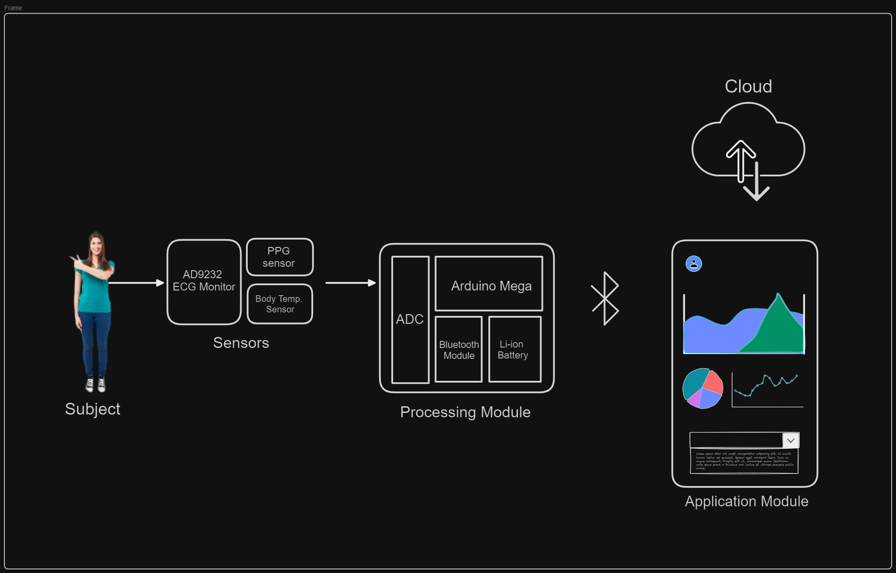
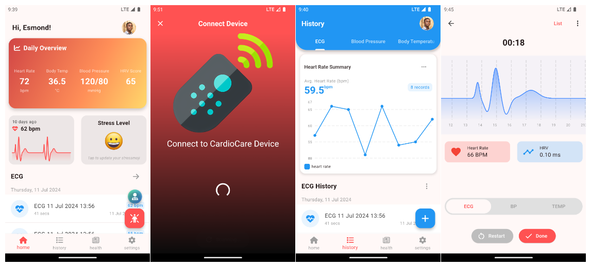

# cardiocare

A mobile app that works with with an IoT device to measure and monitor a user's health parameters: `ecg`, `blood pressure`, and `body temperature`.

## Cardiocare System

## Cardiocare Interface

